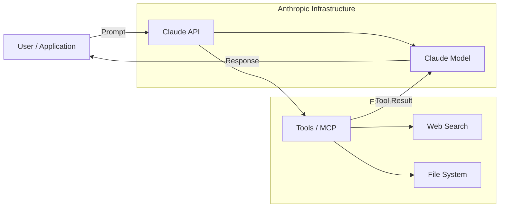

# Claude — Tổng quan

## Giới thiệu

> Claude là AI assistant do Anthropic tạo ra, được thiết kế để hữu ích, vô hại và trung thực. Ra mắt năm 2023, Claude nổi bật với khả năng lý luận sâu, viết code, phân tích văn bản và xử lý tài liệu dài. Claude được xây dựng trên nền tảng Constitutional AI — phương pháp huấn luyện độc quyền của Anthropic giúp model tự căn chỉnh hành vi theo các nguyên tắc đạo đức.

**Phiên bản hiện tại:** Claude Sonnet 4 / Claude Opus 4  
**Ngôn ngữ chính:** Đa ngôn ngữ (tiếng Anh, tiếng Việt, và 50+ ngôn ngữ)  
**License:** Proprietary (API có phí, claude.ai có gói miễn phí)  
**Trang chủ:** https://www.anthropic.com

---

## Kiến trúc tổng quan



**Luồng xử lý cơ bản:**
```
User gửi message
    → API nhận và định tuyến đến model
    → Model xử lý (reasoning + generation)
    → Nếu có tool: gọi tool → nhận kết quả → tiếp tục generate
    → Trả về response
```

---

## Các khái niệm cốt lõi

| Khái niệm | Mô tả |
|-----------|-------|
| System Prompt | Hướng dẫn thiết lập vai trò, ngữ cảnh và hành vi của Claude trước khi conversation bắt đầu |
| Message | Đơn vị giao tiếp, gồm `role` (user/assistant) và `content` |
| Context Window | Số token tối đa Claude có thể xử lý trong một lần — Claude 3.5+ hỗ trợ 200K token |
| Token | Đơn vị xử lý văn bản (~4 ký tự tiếng Anh, ~2 ký tự tiếng Việt) |
| Tool Use | Khả năng Claude gọi external function/API để lấy thông tin hoặc thực hiện hành động |
| Streaming | Trả về response dần dần (từng token) thay vì chờ generate xong toàn bộ |
| Temperature | Tham số kiểm soát độ ngẫu nhiên của output (0 = deterministic, 1 = sáng tạo hơn) |
| Constitutional AI | Phương pháp huấn luyện của Anthropic để Claude tự đánh giá và cải thiện output theo nguyên tắc |

### System Prompt

Là đoạn text đặt trước conversation, định nghĩa:
- Vai trò của Claude (trợ lý, chuyên gia, nhân vật...)
- Ngữ cảnh business (tên công ty, sản phẩm, quy trình)
- Ràng buộc hành vi (tone, ngôn ngữ, điều không được làm)
- Format output mong muốn

```python
system = """Bạn là trợ lý hỗ trợ khách hàng của Công ty ABC.
Luôn trả lời bằng tiếng Việt, lịch sự và ngắn gọn.
Chỉ trả lời các câu hỏi liên quan đến sản phẩm của chúng tôi."""
```

### Tool Use

Claude có thể được cấp "tools" — các function mà Claude có thể gọi khi cần:

```
User: "Thời tiết Hà Nội hôm nay thế nào?"
Claude: [gọi tool get_weather(city="Hanoi")]
Tool: {temperature: 32, condition: "Sunny"}
Claude: "Hà Nội hôm nay 32°C, trời nắng."
```

### Context Window

Claude có context window 200K token — tương đương ~500 trang A4. Điều này cho phép:
- Xử lý toàn bộ codebase lớn
- Phân tích tài liệu dài như báo cáo, hợp đồng
- Duy trì conversation dài mà không mất ngữ cảnh

---

## Khi nào nên dùng

- **Phân tích & tóm tắt tài liệu dài:** hợp đồng, báo cáo, nghiên cứu
- **Viết và review code:** debug, refactor, giải thích logic
- **Xây dựng chatbot / AI assistant:** customer support, internal tool
- **Xử lý ngôn ngữ tự nhiên:** phân loại, trích xuất thông tin, dịch thuật
- **Agentic workflow:** tự động hóa task phức tạp qua tool use
- **RAG (Retrieval-Augmented Generation):** kết hợp với vector DB để trả lời từ knowledge base

## Khi nào KHÔNG nên dùng

- **Real-time data cần cực kỳ chính xác:** giá cổ phiếu, kết quả thể thao live (cần kết hợp tool)
- **Task cần deterministic 100%:** tính toán tài chính phức tạp nên dùng code thực
- **Xử lý ảnh/video nặng:** dùng model chuyên biệt (Vision, Whisper...)
- **Chi phí thấp cho task đơn giản:** các task rule-based đơn giản không cần LLM

---

## Các model Claude hiện tại

| Model | Điểm mạnh | Use case |
|-------|-----------|----------|
| Claude Opus 4 | Thông minh nhất, lý luận sâu | Research, task phức tạp |
| Claude Sonnet 4 | Cân bằng tốc độ & chất lượng | Production API, chatbot |
| Claude Haiku 3.5 | Nhanh nhất, chi phí thấp nhất | High-volume, task đơn giản |

---

## Tài nguyên chính thức

- [Documentation](https://docs.anthropic.com)
- [API Reference](https://docs.anthropic.com/en/api)
- [Prompt Engineering Guide](https://docs.anthropic.com/en/docs/build-with-claude/prompt-engineering/overview)
- [Claude.ai](https://claude.ai)
- [Anthropic Cookbook (GitHub)](https://github.com/anthropics/anthropic-cookbook)
